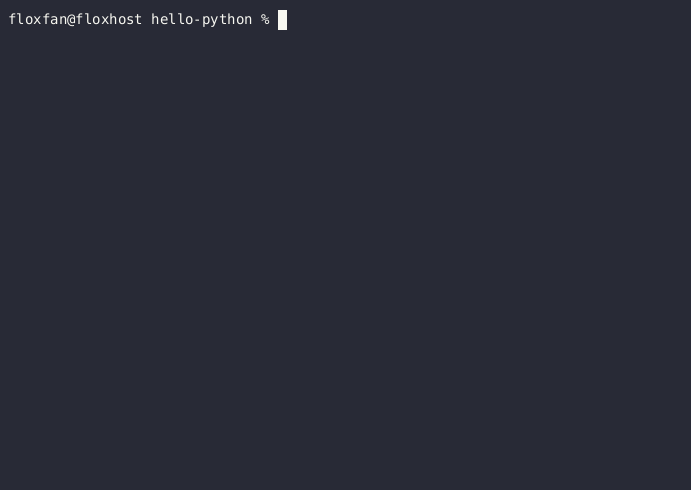

    

## Quick Tour of flox

flox is a multi-platform and reproducible environment manager
for curating portable collections of tools
for use across distributions and in any context.
This means you can:

 

1. Install and run software anywhere
2. Share collections of software that others can use
3. Build software the same way in any environment
4. Publish software for re-use

 
 
 

Lets look at the entire flox lifecycle.

## Install and run packages

Install almost any open source package on any Linux or MacOS machine.
flox is compatible with all linux distributions.
You can use it to install packages on your development machine, your EC2 instances,
or anything else without being locked in to a distro-dependent package manager.

 

## Share package collections

Synchronize tools across your machines.
With flox you can curate a collection of packages once and then use them on your servers,
laptop, and/or desktop with no additional set-up or maintenance.
flox keeps everything synchronized and allows global rollbacks.
Keep everyone on the same page and up-to-date
without shipping clunky containers or AMIs around your team.
You can make global changes to your team's tools,
view change logs,
and perform global upgrades and rollbacks.

 

## Build your own packages

Packages built with flox run the same everywhere.
No containers or fancy CI pipeline required.

Use different versions of development tools side-by-side with no extra set-up.
No need to worry about conflicting versions of transitive dependencies
or jump through hoops with brew, yum, and apt-get
when you switch between projects and versions.

Store your environments in the cloud.
flox can globally synchronize your runtime
and project-specific development environments everywhere you work,
so feel at home on every server, laptop, and desktop
you use without a lengthy set-up.

 

## Publish your packages

flox makes it easy to publish and distribute your own packages
for others to use
just as they would use any other open source package.

 

## Where to go from here

Not sure if you get it yet? Already having ideas for how you can use it?
Either way, carry on and
[install flox](https://beta.floxdev.com/docs/getting-started/install-flox/)
to get started!
