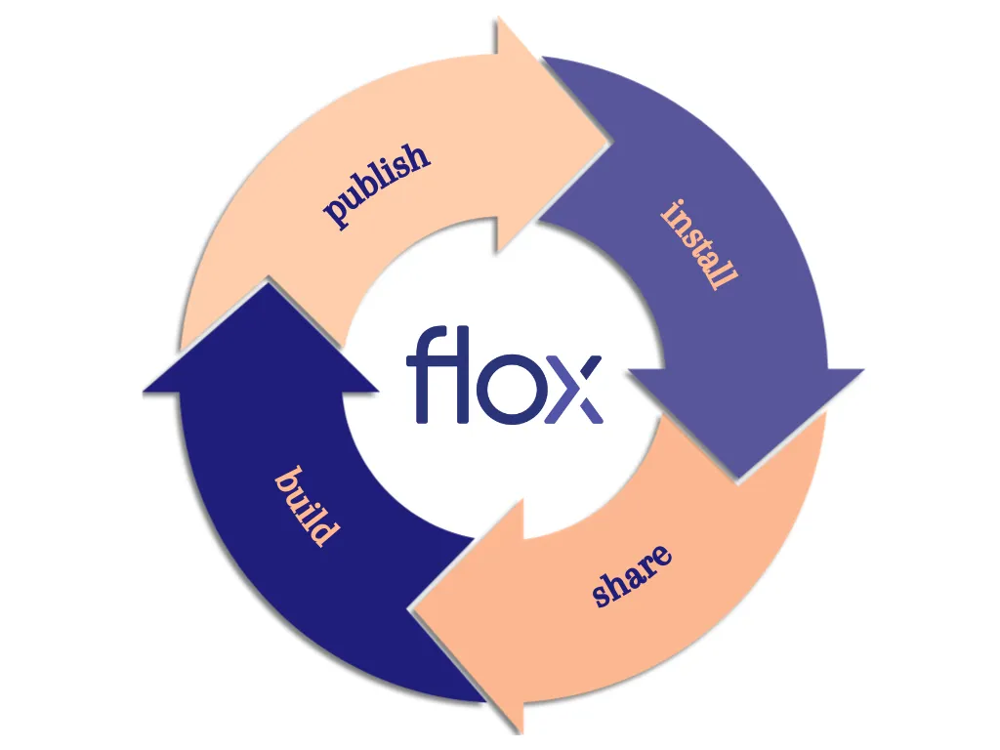

<p>
    <a href="https://floxdev.com" target="_blank"></a>
</p>


## flox (beta)

The [flox](https://floxdev.com) CLI is a multi-platform environment manager
built on [Nix](https://github.com/nixOS/nix).



With flox you can:

1. Install and run software anywhere
2. Share collections of software that others can use
3. Build software the same way in any environment
4. Publish software for re-use


## Installation

You can download the flox CLI via one of our native installers for Mac, Linux, or Windows WSL [here](https://floxdev.com/docs).

## Usage

See the [docs](https://floxdev.com/docs) for more detail on usage.

#### Search through available packages:

``` { .console .no-copy }
$ flox search ripgrep
ripgrep - A utility that combines the usability of The Silver Searcher with the raw speed of grep
  stable.nixpkgs-flox.ripgrep@12.1.1
  stable.nixpkgs-flox.ripgrep@13.0.0
  staging.nixpkgs-flox.ripgrep@13.0.0
  unstable.nixpkgs-flox.ripgrep@13.0.0
```

#### Install a package:

``` { .console .no-copy }
$ flox install ripgrep
created generation 1
```

#### Create a new environment:

``` { .console .no-copy }
$ flox create
created environment default (aarch64-linux)
```

#### Activate an environment¶
``` { .console .no-copy }
$ flox install cowsay
created generation 2
$ flox activate
flox [default] $ cowsay '¡Hola!'
 ________
< !Hola! >
 --------
        \   ^__^
         \  (oo)\_______
            (__)\       )\/\
                ||----w |
                ||     ||
flox [default] $ exit
```

#### Use another's environment:

``` { .console .no-copy }
$ flox pull -e flox-examples/demo
Total 0 (delta 0), reused 0 (delta 0), pack-reused 0
To /home/USER/.cache/flox/meta/flox-examples
 * [new branch]      aarch64-linux.demo -> aarch64-linux.demo
$ flox activate -e flox-examples/demo
flox [flox-examples/demo default] $ fortune | cowsay
 _____________________________________
/ Spock: We suffered 23 casualties in \
\ that attack, Captain.               /
 -------------------------------------
        \   ^__^
         \  (oo)\_______
            (__)\       )\/\
                ||----w |
                ||     ||
flox [flox-examples/demo default] $ exit
```


## `nixpkgs-flox`

The flox CLI gets its packages from the
[nixpkgs-flox](https://github.com/flox/nixpkgs-flox) channel, which is created
using Nixpkgs.
Using packages from a flox channel adds a few features as compared to using
Nixpkgs directly: semantic versioning, stabilities, and guaranteed cache hits.
See the [docs](https://floxdev.com/docs/basics) for more.

## Contributing

We welcome contributions to this project. Please read the [Contributor guide](./CONTRIBUTING.md) first.

#### Building from source

The flox CLI is written in Rust. Building flox requires a running Nix daemon.

The simplest way to build flox is via flox!
- Download `flox` and run `flox build` in the project directory.

If you're a Nix user, you can run the following:
`nix build .#flox --extra-experimental-features "nix-command flakes"`.

See the [contributor guide](./CONTRIBUTING.md) for more information.

## License

The flox CLI is licensed under the GPLv2. See [LICENSE](./LICENSE).

## Community

Find us on [Twitter](https://twitter.com/floxdevelopment) and [Discourse](https://discourse.floxdev.com).

For updates to the flox CLI, follow this repo on [GitHub](https://github.com/flox/flox)!
