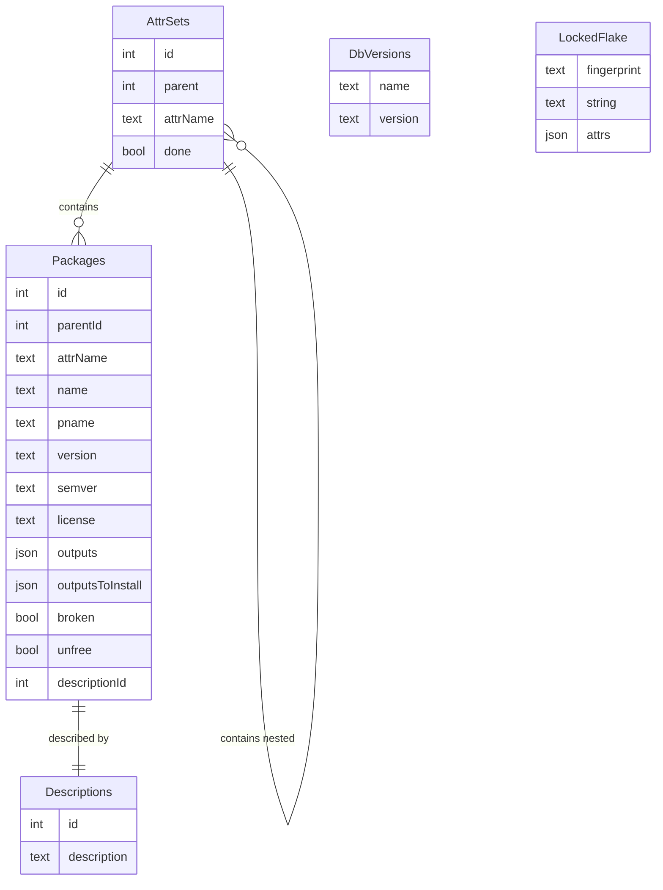

# Flox Package Database

CRUD operations on `nix` package metadata.

[Documentation](https://flox.github.io/pkgdb/index.html)

Additional documentation may be found in the `<pkgdb>/docs` directory.
This includes JSON input/output schemas used by commands such as `pkgdb search`
and `pkgdb resolve`.

Links to additional documentation may be found at the bottom of this file.


### Purpose

Evaluating nix expressions for an entire flake is expensive but necessary for 
features like package search. 
This tool provides a way to scrape the data from a flake once and store it in a 
database for later usage.

The current responsibility of the `pkgdb` tool extends only as far as scraping 
a flake and generating a database. 
The database should be queried using standard sqlite tools and libraries and all 
decisions about how and when to generate and update the database are left up to 
the consumer.


### Compilation

```bash
$ nix develop;
$ make -j;
```

See [CONTRIBUTING.md](./CONTRIBUTING.md) for more information.


### Usage

#### pkgdb scrape

Build the database with the `scrape` subcommand:

```bash
$ pkgdb scrape github:NixOS/nixpkgs;
fetching flake 'github:NixOS/nixpkgs'...
/Users/me/.cache/flox/pkgdb-v0/93a89abd052c90a33e8787a7740f2459cdb496980848011ae708b0de1bbfac82.sqlite
```

By default, packages will be scraped from packages.[system arch] and stored in 
`~/.cache` in a database named after the flake fingerprint. 
These can be overridden as desired:

```bash
$ pkgdb scrape github:NixOS/nixpkgs --database flakedb.sqlite legacyPackages aarch64-darwin
```

If the database for a given flake already exists and is asked to re-process an 
existing package set, it will be skipped. Use `--force` to force 
an update/regeneration.

Once generated, the database can be opened and queried using `sqlite3`.

```bash
$ sqlite3 flakedb.sqlite '.mode json' 'SELECT name, version FROM Packages LIMIT 10';
[{"name":"AMB-plugins-0.8.1","version":"0.8.1"},
{"name":"ArchiSteamFarm-5.4.7.3","version":"5.4.7.3"},
{"name":"AusweisApp2-1.26.7","version":"1.26.7"},
{"name":"BeatSaberModManager-0.0.5","version":"0.0.5"},
{"name":"CHOWTapeModel-2.10.0","version":"2.10.0"},
{"name":"CertDump-unstable-2023-07-12","version":"unstable-2023-07-12"},
{"name":"ChowCentaur-1.4.0","version":"1.4.0"},
{"name":"ChowKick-1.1.1","version":"1.1.1"},
{"name":"ChowPhaser-1.1.1","version":"1.1.1"},
{"name":"CoinMP-1.8.4","version":"1.8.4"}]
```


##### Expected Client Usage

This utility is expected to be run multiple times if a client wishes to
"fully scrape all the things" in a flake.
This utility is a plumbing command used by a client application, we aren't
particularly concerned with the repetitive strain injury a user would suffer if
they tried to scrape everything in a flake interactively; rather we aim to do
less in a single run and avoid scraping info the caller might not need for their
use case.

A given client application that did want to scrape a flake completely would run
something along the lines of:

```shell
$ lockedRef="github:NixOS/nixpkgs/e8039594435c68eb4f780f3e9bf3972a7399c4b1";
$ dbPath=;
$ for subtree in packages legacyPackages; do
    for system in x86_64-linux x86_64-darwin aarch64-darwin aarch64-linux; do
      pkgdb scrape "$lockedRef" "$subtree" "$system";
    done
  done
$ sqlite3 "$dbPath" 'SELECT COUNT( * ) FROM Packages';
```

In the example above we the caller would passes in a locked ref, this was
technically optional, but is strongly recommended.
What's important is that invocations that intend to append to an existing
database ABSOLUTELY SHOULD be using locked flake references.
In the event that you want to use an unlocked reference on the first call, you 
can extract a locked flake reference from a database for later runs, but
official recommendation is to lock flakes before looping.

If the caller _really_ wants to they could pass an unlocked ref on the first
invocation, and yank the locked reference from the resulting database.
This is potentially useful for working with local flakes in the event that you 
don't want to use a utility like `nix flake prefetch` or `parser-util` to lock 
your references for you:

```shell
$ dbPath="$( pkgdb scrape "$PWD/my-flake" packages x86_64-linux; )";
$ lockedRef="$( sqlite3 "$dbPath" 'SELECT string FROM LockedFlake'; )";
$ pkgdb scrape "$lockedRef" packages aarch64-linux;
...<SNIP>...
```


#### pkdb get

The `pkgdb get {db,done,flake,id,path}` subcommands expose a handful of special
queries for package databases that may be useful for simple scripts.
These don't have queries for package metadata, `sqlite3` is recommended for
these types of queries.

Subcommands:
- `pkgdb get db`    Get absolute path to Package DB for a flake
- `pkgdb get done`  Check to see if an attrset and its children has been scraped
- `pkgdb get flake` Get flake metadata from Package DB
- `pkgdb get id`    Lookup an attribute set or package row `id`
- `pkgdb get path`  Lookup an (AttrSets|Packages).id attribute path


#### pkgdb list

List all known databases and their associated flake information.
Accepts the options `--cachedir PATH` and `--json`.
See `pkgdb list --help` for more info.


### Schema

The data is represented in a tree format matching the `attrPath` structure.
The two entities are `AttrSets` (branches) and Packages (leaves).
Packages and `AttrSets` each have a `parentId`, which is always found
in `AttrSets`.
`AttrSets.done` (boolean) indicates that an attribute set and all of its
children, have been _fully scraped_ and do not need to be reprocessed.

Descriptions are de-duplicated (for instance between two packages for separate
architectures) by a `Descriptions` table.

`DbVersions` and `LockedFlake` tables store metadata about the version of
`pkgdb` that generated the database and the flake which was scraped.


#### Details

If they are defined explicitly, `pname` and `version` will be read from the
corresponding attributes.
Otherwise, they will be parsed from the `name`.
If `version` can be converted to a semver, it will be.

Note that the `attrName` for a package is the actual name in the tree.

If `outputsToInstall` is not defined, it will be the set of `outputs` up to and
including `"out"`.




### Databases

Each locked flake has its own database keyed using a unique _fingerprint_.
The separation between these databases simplifies change detection and handling
of overridden inputs to flakes.
These fingerprints are identical to those used by `nix` to create its own
_eval caches_.


#### Cache Directory

Some commands allow database paths to be explicitly set with `--database`,
while those which act on multiple databases will place databases under
the environment variable `PKGDB_CACHEDIR` if it is set, otherwise the directory
`${XDG_CACHE_HOME:-$HOME/.cache}/flox/pkgdb-v<SCHEMA-MAJOR>` is used.


#### Garbage Collection

Because each unique locked flake has its own database, over time these databases
will accumulate and require garbage collection.

At this time there is no automated garbage collection mechanism, but simply
deleting you cache directory will suffice.


### Options and Settings

#### `--ga-registry`

Several commands such as `pkgdb search` and `pkgdb manifest` take an option
`--ga-registry` which changes the behavior of _registry_ constructs to contain
only a single input which provides `nixpkgs=github:NixOS/nixpkgs/release-23.05`.

When `--ga-registry` is provided, it is an error for users to write `env-base`
or `registry` fields.

In the future this flag will be removed allowing users to set custom registries
with multiple inputs or multiple branches.

For the purposes of testing we have provided an environment variable
`_PKGDB_GA_REGISTRY_REF_OR_REV` where you can provide an alternative `git` ref
( tag or branch name ) or a long revision hash.
This is used in our test suite.


## More Documentation
- [Registry Schema](./docs/registry.md)
- [Search Parameters](./docs/search.md)
- [Manifests](./docs/manifests.md)
- [Lockfiles](./docs/lockfile.md)
