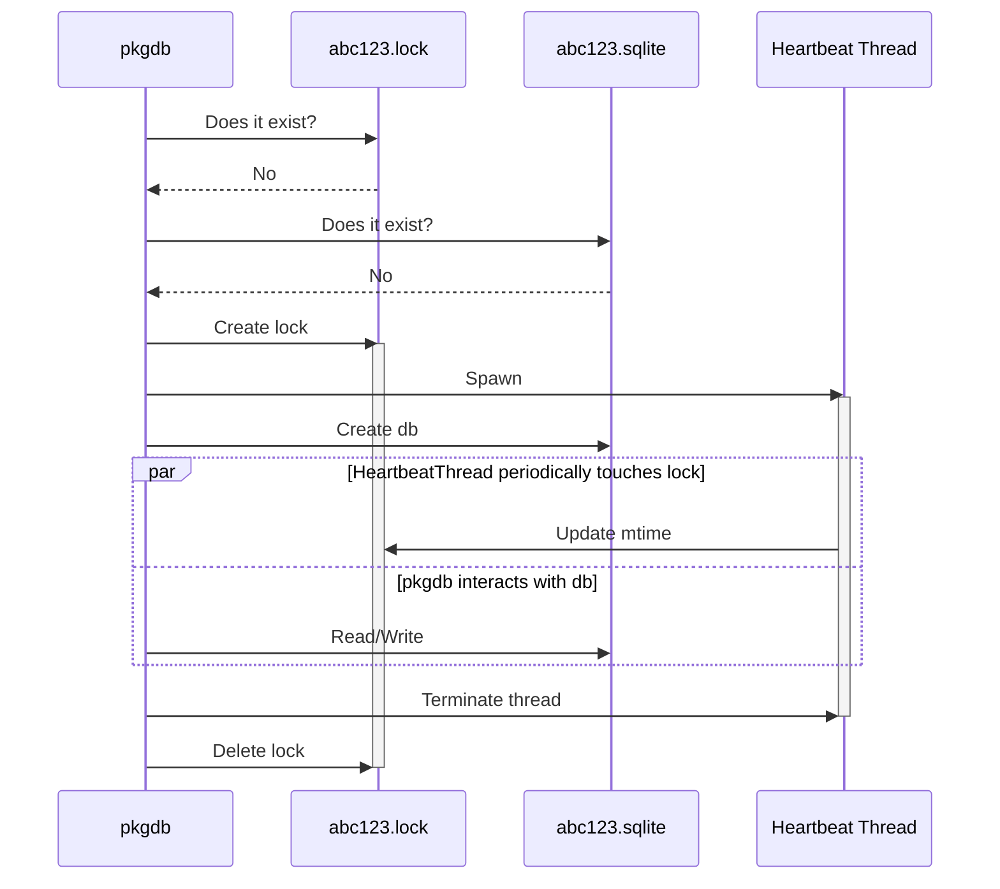
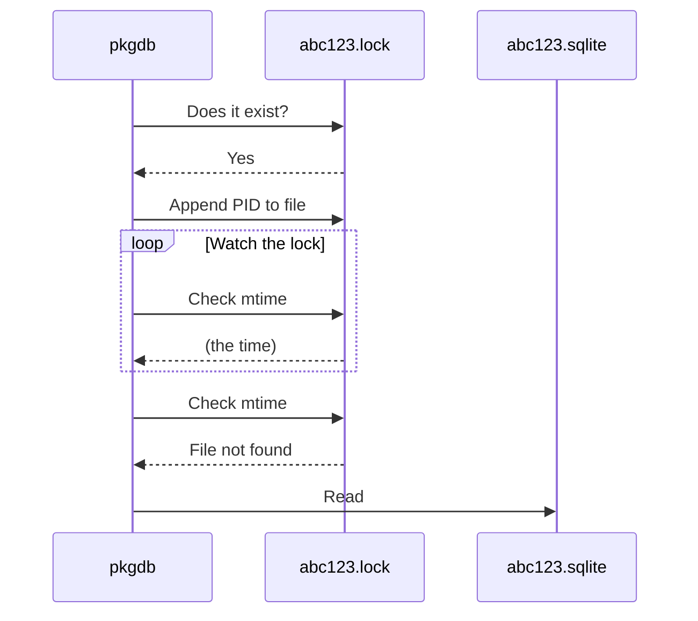
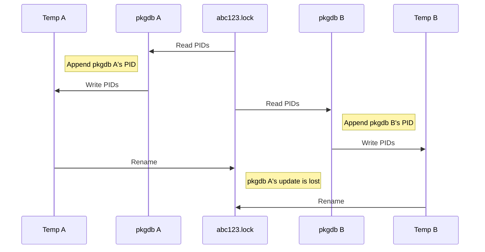

# Database locking

During testing, CI, or after a user's first install, it's entirely possible
that more than one process could try to create the package database at the same
time.
This means that multiple process may end up trying to create the database
without knowledge of the other processes also trying to create the database,
which SQLite will helpfully prevent by locking the database during writes.
Predicting where this "database is locked" error will occur is tricky,
and getting it right is also tricky.
For this reason we've decided to prevent more than one process from trying to
create the database at all via a locking mechanism.

## Algorithm
Let's start with a single `pkgdb` process starting from scratch.
The basic idea is:
- Check whether the db lock exists.
- If the lock doesn't exist, check if the db exists.
- If the db doesn't exist, we get to create it.
- Create the db lock.
- Spawn a thread that will periodically touch the lock so other processes 
interested in the lock know that the writer is still alive.
- Create the db and make writes to it.
- When done, the thread is terminated and the db lock is deleted.

Now let's see what happens from the point of view of a second `pkgdb` process that's created after the db lock is created.
The basic idea is:
- Append this `pkgdb` process's PID to the lock to register interest.
- Periodically check the mtime of the lock.
- If the last within some interval, the writer must still be alive.
- Keep waiting until you notice the file has disappeared.
- Once the lock disappears you know the writer has finished.
- You can now read the database.

 
If the mtime of the lock is stale, the original writer must have crashed.
At this point all waiting `pkgdb` processes read the PIDs in the lock.
The first PID in the file takes over the writing process and removes its PID
from the db lock so that if it crashes the next `pkgdb` process can take over.

There are several possible race conditions in this procedure,
namely "time of check vs. time of use,"
so care is taken to mitigate them.
The check whether the lock exists is atomic in that it is a call to `open` that
fails if the file exists.

Writing the PID to the lock first happens in a temporary file that is then
renamed to the lock.
This can overwrite a PID write from another process so each process writing its
PID does a check afterwards to ensure that its PID is in the lock.
If the PID isn't found in the lock,
the read, update, write, rename process is repeated.
This means that the final waiting order may not be the same order that the
original interests were registered,
but we actually don't care about that,
we only care that one process writes while others wait and there's _some_ order
for taking over writing if the writer fails.

## Consequences

Since we shouldn't touch the database unless we have the lock,
this means we can't automatically initialize the database
(someone else might be writing to it) without the lock.

An initial draft of this required you to acquire the lock and manually call
`PkgDbInput::init`,
but this turned out to be error prone.
As a compromise between nice APIs, practicallity, and safety,
the lock is now acquired whenever a `PkgDbInput` is created,
which means that the lock is acquired twice for every database during scraping.
This turns out to add negligible overhead,
so it's not really an issue in practice,
but those of us that care about the utmost efficiency may turn their noses up.

## Troubleshooting

### "db lock unexpectedly missing"

This error is reported by the heartbeat thread.
The only entity responsible for deleting the lock is the process that has the
lock,
so if someone else deleted the lock it means that more than one process thinks
it has the lock.
This could either mean that multiple processes were launched at the same time
and there was an error figuring out who would first take the lock,
or it could mean that the original writer crashed and there was an error
determining who would take over.
